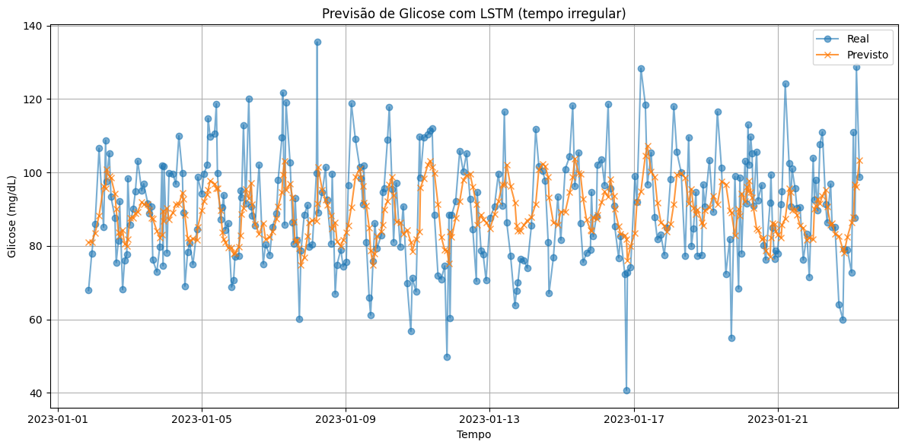

# Glucose_LSTM_TimesSeries
Simulação de Medições de Glicose com modelagem preditiva com LSTM.


# 🧠 Glucose_LSTM

Este projeto tem como objetivo fazer modelagem preditiva com o modelo LSTM(Long Short-Term Memory) que é modelo de RNN, com a biblioteca Keras, sendo muito utilizada em dados não estacionários, e aprende padrões de sazonalidade e tendências sem exigir explicitamente.

## ✨ Funcionalidades

- Geração de Dados simulados: medições de Glicose.
- Preparação dos Dados: Normalização com MinMaxScaler.
- Treinamento do Modelo com biblioteca TensorFlow.Keras: Sequential e LSTM.
- Realizando previsões futuras.

## 🛠 Tecnologias Utilizadas

- Python 3.x
- Sklearn: Preprocessamento -> MinMaxScaler
- RNNs TensorFlow e Keras: Sequential e LSTM

## 🤝 Resultados



## 🚀 Instalação

Clone o repositório e instale as dependências:

```bash
git clone https://github.com/jaquelinesfernandes/Glucose_LSTM_TimesSeries.git
cd Glucose_LSTM_TimesSeries
